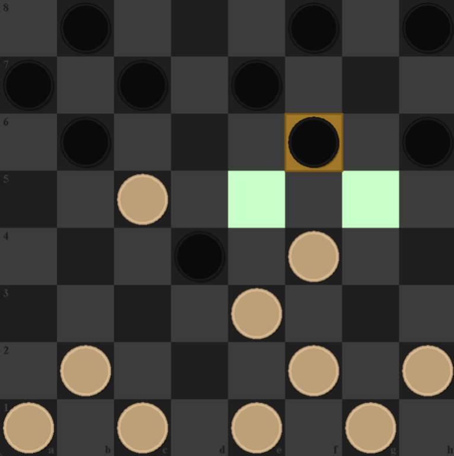

# Checkers Game

## Overview
This project is a **Checkers game** featuring a user-friendly **Java Swing** GUI for the graphical interface, with the gameplay logic implemented in **C++**. The integration between Java and C++ is achieved using **Java Native Interface (JNI)**. The game allows two players to enjoy a classic checkers match on the same machine with standard rules.

## Features
- **Interactive GUI**:
  - Choosing tiles or keyboard input functionality for moving pieces.
  - Visual indicators for valid moves.
- **Standard Checkers Rules**:
  - Legal piece movement enforced.
  - Support for mandatory captures.
  - Promotion of pieces to kings.
- **Highlights**:
  - Displays current player’s turn.
  - Highlights valid moves for the selected piece.
- **Performance**:
  - Core gameplay logic implemented in optimized C++ code for better performance.
- **Error Handling**:
  - Prevents illegal moves and provides on-screen feedback.
- **Unit Testing**:
  - Comprehensive tests using **JUnit** to ensure the correctness of Java components.
  
## Gameplay

## Technologies Used
- **Programming Language**: 
  - Java (GUI and application logic)
  - C++ (gameplay rules and logic)
- **GUI Framework**: Java Swing
- **Integration**: Java Native Interface (JNI)
- **Testing**: JUnit
- **Development Environment**: IntelliJ IDEA and IntelliJ CLion.

## How to play
- Launch the application.
- Player 1 (red) starts the game.
- Choose a piece and tile for its ending position; invalid moves will be blocked.
- The game ends when one player has no valid moves left or all their pieces are captured.

## Project structure
- `Main.java` - Entry point of the game
- `src/Main/java/Main` - General classes for the java side
- `src/Resources` - Game assets like chips textures and others
- `src/Test` - Directory with the unit tests of the game
- `CheckersNative` - Directory with all the c++ code
- `README.md` - Project documentation
- `LICENSE` - Project license

## Licence
This project is licensed under the MIT License

## Acknowledgments
Inspired by the american type checkers game
